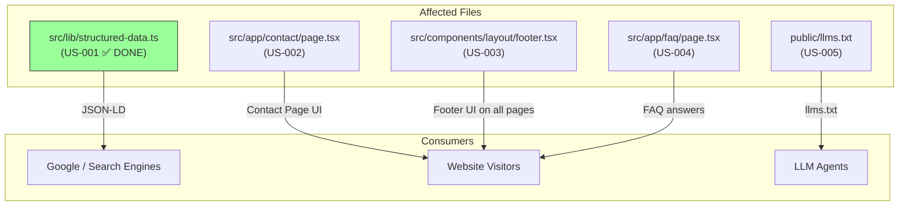
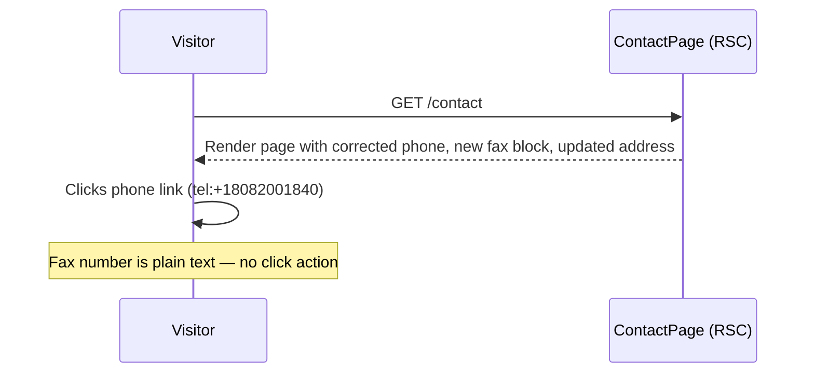

# Contact Information Update & Fax Addition — Technical Design Document

| Field | Value |
|-------|-------|
| **Author(s)** | Jairo |
| **Reviewer(s)** | — |
| **Status** | Draft |
| **Last Updated** | 2026-02-15 |
| **Epic/Ticket** | PRD 004 |
| **Source PRD** | [`prd.md`](./prd.md) |

---

## 1. Introduction

### 1.1 Background & Problem Statement

The Casa Colina Care website displays incorrect contact information across multiple pages and the schema.org structured data. The phone number is a placeholder (`+1 (800) 888-8888`), the street name is misspelled (`Anapalua` instead of `Anapalau`), the postal city uses a neighborhood name (`Hawaii Kai`) instead of the USPS-correct city (`Honolulu`), and the business fax number is absent.

These errors block the primary conversion path (phone inquiry), degrade Google Knowledge Panel accuracy, and prevent referral partners from finding the fax number.

### 1.2 User Stories

- **US-001**: As a search engine crawler, I want accurate phone, fax, and address data in JSON-LD so that Google Knowledge Panel displays correct information
- **US-002**: As a visitor on the Contact page, I want the correct phone, fax, and address so I can reach the facility
- **US-003**: As a visitor on any page, I want the footer to show correct contact info site-wide
- **US-004**: As a visitor reading the FAQ, I want the correct address and phone in answers
- **US-005**: As an LLM consuming `llms.txt`, I want accurate address data

### 1.3 Goals & Non-Goals

**Goals:**

- Replace all instances of placeholder phone `+1 (800) 888-8888` with real number `+1 (808) 200-1840`
- Correct street spelling from `Anapalua` to `Anapalau` in all postal address contexts
- Change postal city from `Hawaii Kai` to `Honolulu` in postal address contexts
- Add fax number `+1 (808) 670-1163` to Contact page, footer, and structured data
- Append `(Hawaii Kai)` neighborhood label to display addresses (not structured data)
- Maintain passing build, lint, type-check, and tests

**Non-Goals:**

- Modifying marketing copy that references "Hawaii Kai" in non-postal contexts (~30 instances)
- Changing contact form validation logic
- Changing email templates
- Adding new icon imports (fax reuses existing `Phone` icon)
- Updating geo-coordinates in structured data
- Changing footer layout structure

---

## 2. Architectural Overview

### 2.1 System Context



### 2.2 Narrative Description

This is a **data correction task** — no new components, routes, APIs, or business logic. All changes are static string replacements and one small JSX block insertion (fax display). The structured data module (`src/lib/structured-data.ts`) has already been updated (US-001 complete). The remaining work is updating display strings in 3 React components and 1 static text file.

---

## 3. Design Details

### 3.1 Reference Values

All changes follow this substitution table:

| Data Point | Old Value | New Value |
|------------|-----------|-----------|
| Phone (display) | `+1 (800) 888-8888` | `+1 (808) 200-1840` |
| Phone (E.164 / href) | `+18008888888` | `+18082001840` |
| Fax (display) | *(absent)* | `+1 (808) 670-1163` |
| Fax (E.164) | *(absent)* | `+18086701163` |
| Street | `189 Anapalua Street` | `189 Anapalau Street` |
| Street (display with neighborhood) | `189 Anapalua Street` | `189 Anapalau Street (Hawaii Kai)` |
| City (postal) | `Hawaii Kai, HI 96825` | `Honolulu, HI 96825` |

### 3.2 US-001: Update Schema.org Structured Data

**Status:** ✅ Complete

**File:** `src/lib/structured-data.ts`

**Trigger:** Build-time — JSON-LD is embedded in `<script type="application/ld+json">` via the root layout.

**System Behavior:**

- **When** the page is rendered, the system **shall** output a JSON-LD `<script>` tag containing `telephone: '+18082001840'`
- **When** the page is rendered, the system **shall** include `faxNumber: '+18086701163'` positioned after `telephone` and before `email`
- **When** the page is rendered, the system **shall** output `streetAddress: '189 Anapalau Street'` without a neighborhood label
- **When** the page is rendered, the system **shall** output `addressLocality: 'Honolulu'`

**Current state** (verified from source):

```typescript
// src/lib/structured-data.ts (already correct)
telephone: '+18082001840',
faxNumber: '+18086701163',
email: 'kriss@casacolinacare.com',
address: {
  '@type': 'PostalAddress',
  streetAddress: '189 Anapalau Street',
  addressLocality: 'Honolulu',
  // ...
}
```

No further changes required.

---

### 3.3 US-002: Update Contact Page — Phone, Fax, and Address

**File:** `src/app/contact/page.tsx`
**Component type:** Server Component (no `'use client'` directive)

**Trigger:** User navigates to `/contact`.

**System Behavior:**

- **When** the Contact page renders, the system **shall** display a phone link with `href="tel:+18082001840"` and display text `+1 (808) 200-1840`
- **When** the Contact page renders, the system **shall** display a fax block between the Phone and Email blocks, showing `+1 (808) 670-1163` as plain text (NOT an `<a>` link)
- **When** the Contact page renders, the system **shall** display the street as `189 Anapalau Street (Hawaii Kai)` and the city as `Honolulu, HI 96825`

**Changes (5 edits):**

| # | Line | What | Old | New |
|---|------|------|-----|-----|
| 1 | 72 | Phone href | `href="tel:+18008888888"` | `href="tel:+18082001840"` |
| 2 | 75 | Phone display | `+1 (800) 888-8888` | `+1 (808) 200-1840` |
| 3 | 78–79 | Insert fax block | *(empty — between Phone `</div>` and Email `<div>`)* | New `<div>` block (see below) |
| 4 | 104 | Street | `189 Anapalua Street` | `189 Anapalau Street (Hawaii Kai)` |
| 5 | 106 | City | `Hawaii Kai, HI 96825` | `Honolulu, HI 96825` |

**Fax block to insert** (after the Phone block closing `</div>` on line 78, before the Email block opening `<div>` on line 80):

```tsx
{/* Fax */}
<div className="flex items-start gap-4">
  <Phone
    className="mt-1 h-5 w-5 shrink-0 text-primary"
    aria-hidden="true"
  />
  <div>
    <p className="font-medium">Fax</p>
    <p className="text-muted-foreground">+1 (808) 670-1163</p>
  </div>
</div>
```

**Critical constraints:**

- The fax number must be plain `<p>` text, NOT wrapped in an `<a>` tag — fax numbers are not dialable from phones
- No new imports needed — the `Phone` icon from `lucide-react` is already imported on line 1
- The fax block reuses the same className structure as the Phone block for visual consistency

**Sequence Diagram:**



---

### 3.4 US-003: Update Footer — Phone, Fax, and Address

**File:** `src/components/layout/footer.tsx`
**Component type:** Server Component (no `'use client'` directive)

**Trigger:** Any page render (footer appears on all pages).

**System Behavior:**

- **When** any page renders, the footer **shall** display phone link `href="tel:+18082001840"` with text `+1 (808) 200-1840`
- **When** any page renders, the footer **shall** display a fax entry `Fax: +1 (808) 670-1163` as plain text between phone and email
- **When** any page renders, the footer address block **shall** read `189 Anapalau Street (Hawaii Kai)` and `Honolulu, HI 96825`

**Changes (5 edits):**

| # | Line | What | Old | New |
|---|------|------|-----|-----|
| 1 | 21 | Street in `<address>` | `<p>189 Anapalua Street</p>` | `<p>189 Anapalau Street (Hawaii Kai)</p>` |
| 2 | 22 | City in `<address>` | `<p>Hawaii Kai, HI 96825</p>` | `<p>Honolulu, HI 96825</p>` |
| 3 | 52 | Phone href | `href="tel:+18008888888"` | `href="tel:+18082001840"` |
| 4 | 55 | Phone display | `+1 (800) 888-8888` | `+1 (808) 200-1840` |
| 5 | 57–58 | Insert fax entry | *(empty — between phone `</p>` and email `<p>`)* | New `<p>` block (see below) |

**Fax entry to insert** (after the phone `</p>` on line 57, before the email `<p>` on line 58):

```tsx
<p>
  <span className="text-foreground">Fax: </span>
  +1 (808) 670-1163
</p>
```

**Critical constraints:**

- The fax number must NOT be wrapped in an `<a>` tag
- No icon needed — footer contact items don't use lucide-react icons
- The fax entry matches the existing `<p>` structure in the Contact `<div>` section

---

### 3.5 US-004: Update FAQ Location Answer

**File:** `src/app/faq/page.tsx`
**Component type:** Server Component (no `'use client'` directive)

**Trigger:** User navigates to `/faq` and opens relevant accordion items.

**System Behavior:**

- **When** the FAQ page renders and the "Where is Casa Colina Care located?" accordion is expanded, the system **shall** display `We are located at 189 Anapalau Street (Hawaii Kai), Honolulu, HI 96825.`
- **When** the FAQ page renders and the "How do I begin the admissions process?" accordion is expanded, the system **shall** display `+1 (808) 200-1840`
- **If** other FAQ answers reference "Hawaii Kai" as a marketing term, the system **shall** leave them unchanged

**Changes (2 edits in the `faqCategories` array):**

| # | Line | What | Old | New |
|---|------|------|-----|-----|
| 1 | 36 | Location answer address portion | `189 Anapalua Street in beautiful Hawaii Kai, HI 96825` | `189 Anapalau Street (Hawaii Kai), Honolulu, HI 96825` |
| 2 | 51 | Admissions answer phone | `+1 (800) 888-8888` | `+1 (808) 200-1840` |

**Critical constraint:** Only the address portion of the location answer changes. The rest of the sentence (`Our home is nestled...`) remains unchanged. Do NOT modify any other "Hawaii Kai" references in other FAQ answers (e.g., line 31 General category answer).

---

### 3.6 US-005: Update LLM Context File

**File:** `public/llms.txt`
**Type:** Static text file served at `https://casacolinacare.com/llms.txt`

**Trigger:** Any LLM or agent requesting `/llms.txt`.

**System Behavior:**

- **When** `/llms.txt` is requested, the system **shall** return HTTP 200 with `Content-Type: text/plain` and the body **shall** contain `189 Anapalau Street (Hawaii Kai), Honolulu, HI`

**Change (1 edit):**

| # | Line | Old | New |
|---|------|-----|-----|
| 1 | 7 | `- The postal address of the facility is 189 Anapalua Street, Honolulu, HI` | `- The postal address of the facility is 189 Anapalau Street (Hawaii Kai), Honolulu, HI` |

No other lines in the file are modified.

---

### 3.7 Shared Architecture — Design Decisions

| Decision | Chosen | Alternative | Rationale |
|----------|--------|-------------|-----------|
| Fax icon | Reuse `Phone` icon from lucide-react | Import dedicated `Printer` or custom fax icon | PRD mandates no new imports; `Phone` icon is close enough and already available |
| Fax link behavior | Plain text (`<p>`) | `<a href="fax:...">` link | Fax numbers are not dialable on phones; clickable fax links provide no value |
| Fax position on Contact page | Between Phone and Email blocks | After Email | Logical grouping — phone/fax are both telephone-based communication |
| Fax in footer | Plain text with "Fax:" label prefix | Same structure as phone link | Differentiates fax from phone; non-clickable by design |
| Neighborhood label | `(Hawaii Kai)` appended to street in display contexts only | Include in schema.org | schema.org has no standard neighborhood field; appending would pollute structured data |

**Component Hierarchy:**

```
Files modified (no new files created):
├── src/lib/structured-data.ts       ← US-001 ✅ DONE
├── src/app/contact/page.tsx         ← US-002
├── src/components/layout/footer.tsx ← US-003
├── src/app/faq/page.tsx             ← US-004
└── public/llms.txt                  ← US-005
```

---

## 4. Implementation Plan

### 4.1 Phased Approach

All changes are independent string replacements. No dependency ordering is required, but logical grouping is recommended:

| Phase | Story | File | Dependencies | Status |
|-------|-------|------|-------------|--------|
| ✅ Done | US-001 | `src/lib/structured-data.ts` | None | Complete |
| 1 | US-002 | `src/app/contact/page.tsx` | None | Pending |
| 1 | US-003 | `src/components/layout/footer.tsx` | None | Pending |
| 1 | US-004 | `src/app/faq/page.tsx` | None | Pending |
| 1 | US-005 | `public/llms.txt` | None | Pending |

All remaining stories can be implemented in parallel or in any order. Each is a self-contained file edit.

### 4.2 Implementation Workflow Per Story

For each user story, follow this sequence:

1. **Edit** — Make the string replacements / JSX insertions specified in Section 3
2. **Quality gates** — Run `npm run type-check && npm run lint`
3. **Unit tests** — Write tests (Section 5.2), run `npm test -- --run`
4. **Browser verify** — Use `dev-browser` skill to visually confirm changes (Section 5.4)
5. **E2E tests** — Write tests (Section 5.3), run `npm run test:e2e`
6. **Commit** — `feat: [US-ID] - [Story Title]`

### 4.3 Data Migration

No data migration required.

### 4.4 Risk Assessment

| Risk | Likelihood | Impact | Mitigation |
|------|-----------|--------|------------|
| Typo in replacement string | Low | Medium — wrong info displayed | Test cases validate exact strings |
| Accidentally modifying marketing "Hawaii Kai" references | Low | Low — cosmetic | Unit test validates marketing copy unchanged |
| Breaking JSX structure with fax insertion | Low | High — page crash | Type-check + unit tests catch structural errors |
| Missing a phone/address instance | Low | Medium — inconsistency | Grep validation: `grep -r '8008888888' src/` and `grep -r 'Anapalua' src/` must return empty |

---

## 5. Testing Strategy

### 5.1 Test File Locations

| Test Type | File | Validates |
|-----------|------|-----------|
| Unit | `tests/unit/layout-schema.test.tsx` | US-001 (✅ exists) |
| Unit | `tests/unit/contact-page.test.tsx` | US-002 |
| Unit | `tests/unit/footer.test.tsx` | US-003 |
| Unit | `tests/unit/faq-page.test.tsx` | US-004 |
| E2E | `tests/e2e/schema-org.spec.ts` | US-001 (✅ exists) |
| E2E | `tests/e2e/contact-info.spec.ts` | US-002 |
| E2E | `tests/e2e/footer-contact.spec.ts` | US-003 |
| E2E | `tests/e2e/llms-txt.spec.ts` | US-005 |

### 5.2 Unit Tests (Vitest + React Testing Library)

Framework: `npm test -- --run`

**Contact Page Tests** (`tests/unit/contact-page.test.tsx`):

| TC | Scenario | Assertion |
|----|----------|-----------|
| TC-004 | Phone href is correct | `href="tel:+18082001840"` |
| TC-005 | Fax renders as plain text, not a link | No `<a>` wrapping fax number |
| TC-006 | Fax positioned between Phone and Email | DOM order: Phone → Fax → Email |
| TC-007 | Street displays with neighborhood | Text contains `189 Anapalau Street (Hawaii Kai)` |
| TC-008 | City displays as Honolulu | Text contains `Honolulu, HI 96825` |
| TC-009 | Old phone absent | Text does not contain `(800) 888-8888` |

**Footer Tests** (`tests/unit/footer.test.tsx`):

| TC | Scenario | Assertion |
|----|----------|-----------|
| TC-010 | Phone href is correct | `href="tel:+18082001840"` |
| TC-011 | Fax renders as plain text | No `<a>` wrapping fax number |
| TC-012 | Street displays with neighborhood | Text contains `189 Anapalau Street (Hawaii Kai)` |
| TC-013 | City displays as Honolulu | Text contains `Honolulu, HI 96825` |
| TC-014 | Old phone absent | Text does not contain `(800) 888-8888` |

**FAQ Page Tests** (`tests/unit/faq-page.test.tsx`):

| TC | Scenario | Assertion |
|----|----------|-----------|
| TC-F01 | Location answer has correct address | Contains `189 Anapalau Street (Hawaii Kai), Honolulu, HI 96825` |
| TC-F02 | Admissions answer has correct phone | Contains `+1 (808) 200-1840` |
| TC-F03 | Marketing "Hawaii Kai" references preserved | Other FAQ answers still reference Hawaii Kai |

### 5.3 E2E Tests (Playwright)

Framework: `npm run test:e2e`

**Contact Page E2E** (`tests/e2e/contact-info.spec.ts`):

| TC | Scenario | Assertion |
|----|----------|-----------|
| TC-015 | Phone link clickable with correct href | `href="tel:+18082001840"`, visible |
| TC-016 | Fax visible but not clickable | Text visible, NOT inside `<a>` |
| TC-017 | Correct address displayed | Contains corrected street + city; old values absent |

**Footer E2E** (`tests/e2e/footer-contact.spec.ts`):

| TC | Scenario | Pages |
|----|----------|-------|
| TC-018 | Footer phone correct on all pages | `/`, `/about`, `/faq`, `/contact` |
| TC-019 | Footer fax visible, not clickable, all pages | `/`, `/about`, `/faq`, `/contact` |
| TC-020 | Footer address correct on all pages | `/`, `/about`, `/faq`, `/contact` |

**Schema.org E2E** (`tests/e2e/schema-org.spec.ts` — ✅ exists):

| TC | Scenario | Assertion |
|----|----------|-----------|
| TC-021 | JSON-LD valid with correct data | `telephone`, `faxNumber`, `streetAddress`, `addressLocality` all correct |

**llms.txt E2E** (`tests/e2e/llms-txt.spec.ts`):

| TC | Scenario | Assertion |
|----|----------|-----------|
| TC-022 | File accessible with correct address | HTTP 200, contains corrected address, old value absent |

### 5.4 Browser Verification (dev-browser skill)

After implementing each UI story, use the `dev-browser` skill to visually verify changes in the running dev server (`http://localhost:3000`).

**US-002 — Contact Page** (`/contact`):

| Check | What to Verify |
|-------|---------------|
| BV-001 | Phone number displays as `+1 (808) 200-1840` and is a clickable link |
| BV-002 | Fax block appears between Phone and Email with label "Fax" and number `+1 (808) 670-1163` |
| BV-003 | Fax number is NOT a clickable link (plain text) |
| BV-004 | Fax block uses the same icon and styling as the Phone block |
| BV-005 | Street address reads `189 Anapalau Street (Hawaii Kai)` |
| BV-006 | City reads `Honolulu, HI 96825` |
| BV-007 | Old placeholder phone `+1 (800) 888-8888` is nowhere on the page |

**US-003 — Footer** (visible on all pages: `/`, `/about`, `/faq`, `/contact`):

| Check | What to Verify |
|-------|---------------|
| BV-008 | Footer phone displays as `+1 (808) 200-1840` and is a clickable link |
| BV-009 | Footer fax entry shows `Fax: +1 (808) 670-1163` as plain text (not a link) |
| BV-010 | Footer address block reads `189 Anapalau Street (Hawaii Kai)` on first line |
| BV-011 | Footer address block reads `Honolulu, HI 96825` on second line |

**US-004 — FAQ Page** (`/faq`):

| Check | What to Verify |
|-------|---------------|
| BV-012 | Location FAQ answer shows `189 Anapalau Street (Hawaii Kai), Honolulu, HI 96825` |
| BV-013 | Admissions FAQ answer shows `+1 (808) 200-1840` |
| BV-014 | Other FAQ answers mentioning "Hawaii Kai" as a neighborhood remain unchanged |

**Workflow:**

1. Start dev server: `npm run dev`
2. Use `dev-browser` skill to navigate to each page
3. Take screenshots for each verification check
4. If any check fails, fix the issue before running automated tests

### 5.5 Validation Commands

After all changes, these must all pass:

```bash
npm run build           # Exit 0
npm run lint            # Exit 0
npm run type-check      # Exit 0
npm test -- --run       # All unit tests pass
npm run test:e2e        # All E2E tests pass
```

**Grep validation** (should return no results):

```bash
grep -r '8008888888' src/       # No placeholder phone in source
grep -r 'Anapalua' src/         # No misspelled street in source
```

---

## 6. Cross-Cutting Concerns

### 6.1 SEO Impact

- Corrected `telephone`, `faxNumber`, `streetAddress`, and `addressLocality` in JSON-LD improve Google Knowledge Panel accuracy
- Validate with [Google Rich Results Test](https://search.google.com/test/rich-results) after deployment

### 6.2 Accessibility

- Fax block on Contact page includes `aria-hidden="true"` on the decorative icon
- No new interactive elements — fax is intentionally non-interactive

### 6.3 Performance

- Zero impact. No new imports, no new components, no new API calls. All changes are to static strings in SSG pages.

### 6.4 Deployment & Verification

- Standard Vercel deployment. No environment variable changes.
- **Pre-deploy:** Run all validation commands (Section 5.5) + browser verification (Section 5.4)
- **Post-deploy:** Use `dev-browser` skill to verify production URLs:
  - `https://casacolinacare.com/contact` — phone, fax, address
  - `https://casacolinacare.com/faq` — location answer, admissions phone
  - `https://casacolinacare.com/` — footer contact info
  - `https://casacolinacare.com/llms.txt` — corrected address line
  - [Google Rich Results Test](https://search.google.com/test/rich-results) — validate JSON-LD structured data

---

## 7. Traceability Matrix

| Business Objective | User Stories | Test Cases |
|-------------------|-------------|------------|
| OBJ-01: Eliminate placeholder phones | US-001✅, US-002, US-003, US-004 | TC-001✅, TC-004, TC-009, TC-010, TC-014, TC-015, TC-018 |
| OBJ-02: Correct street spelling | US-001✅, US-002, US-003, US-004, US-005 | TC-003✅, TC-007, TC-012, TC-017, TC-020, TC-022 |
| OBJ-03: Add fax number | US-001✅, US-002, US-003 | TC-002✅, TC-005, TC-006, TC-011, TC-016, TC-019, TC-021✅ |
| OBJ-04: Correct postal city | US-001✅, US-002, US-003, US-004, US-005 | TC-003✅, TC-008, TC-013, TC-017, TC-020, TC-022 |
| OBJ-05: Build integrity | All | All tests passing + build/lint/type-check |
